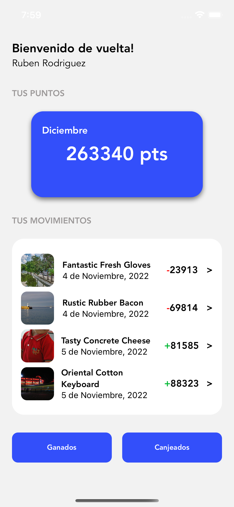
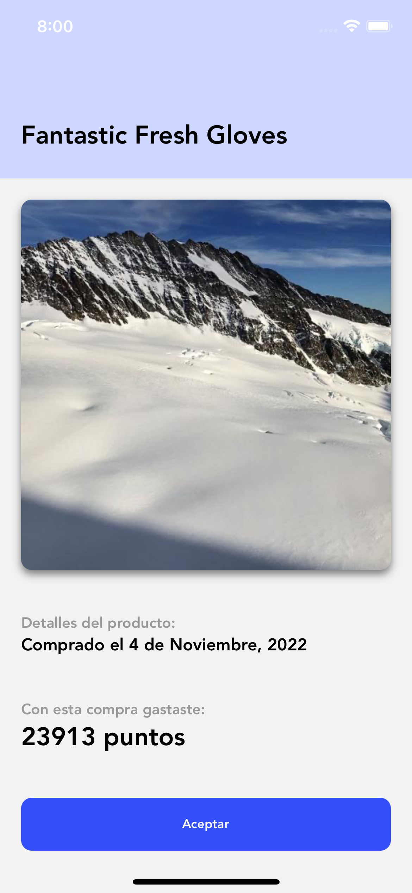
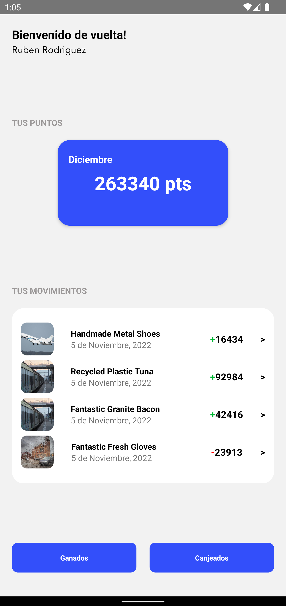
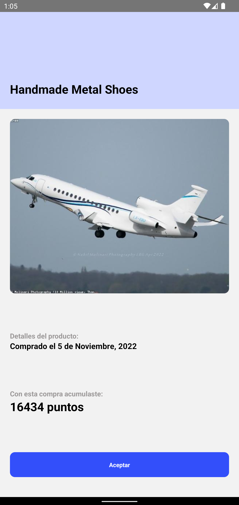

# Digital@FEMSA Code Challenge

## Setup
- Clonar el repositorio
- En el directorio del proyecto correr el comando `yarn` para instalar las dependencias de la aplicación
- Para iniciar el proyecto en un emulador Android, correr el comando `yarn run android`
- Para iniciar el proyecto en un emulador iOS, correr el comando `yarn run ios`
- No son necesarias variables de entorno para iniciar el proyecto

## Testing
- Los tests se ejecutan desde el directorio del proyecto, al correr el comando `yarn run test`

## Screenshots

### iOS

### Android

